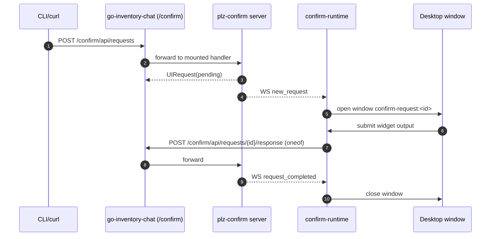
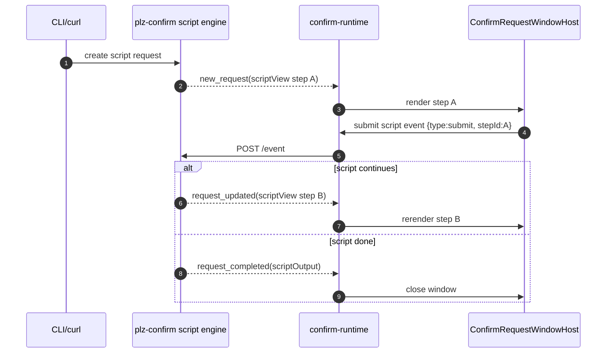

# Postmortem: plz-confirm Integration into go-go-os

## Executive Summary

This integration replaced the legacy plz-confirm browser widget experience with go-go-os desktop windows while preserving plz-confirm as the authoritative backend for request lifecycle and script execution.

The largest technical breakthroughs were:

1. Extracting a public embeddable backend package (`plz-confirm/pkg/backend`) so go-inventory-chat could legally import and mount plz-confirm routes under `/confirm/*`.
2. Building a reusable package-first frontend bridge (`@hypercard/confirm-runtime`) that decodes plz-confirm protojson payloads, tracks active requests in Redux, and opens/closes desktop windows from WS events.
3. Establishing a core-first widget strategy in `@hypercard/engine` so confirm UI primitives are reusable beyond plz-confirm-specific flows.
4. Fixing five regressions discovered during real manual validation: protojson shape mismatch, CLI flag decoding breakage, WS prefix handling, stale queue replay/409 collisions, and missing timestamps.
5. Shipping broad story coverage (widget-level + composite script-section scenarios) so design and implementation handoff is concrete rather than abstract.

Net outcome: operators can run the same plz-confirm APIs/CLI workflows while responding in go-go-os windows, and script state transitions remain backend-owned. The integration is now operational, testable, and documented well enough for intern onboarding.

## Reader Guide

If you are new to the codebase, read in this order:

1. `System Before Integration` to understand the original boundaries.
2. `Architecture Decisions` to understand what changed and why.
3. `Implementation Timeline` to reconstruct execution in exact order.
4. `Incidents and Debugging` to learn recurring failure modes.
5. `Onboarding Runbook` to run and verify the system locally.
6. `Future Integration Playbook` before starting new external-system integrations.

## System Before Integration

### Before state: plz-confirm

plz-confirm already had a complete backend contract:

- Request creation: `POST /api/requests`
- Request response submit: `POST /api/requests/{id}/response`
- Script event submit: `POST /api/requests/{id}/event`
- Keepalive/touch: `POST /api/requests/{id}/touch`
- Wait/poll endpoint: `POST /api/requests/{id}/wait`
- Realtime stream: `GET /ws?sessionId=...`

Backend authority lived in:

- `internal/server/server.go`: request handlers and oneof validation
- `internal/server/script.go`: script update lifecycle
- `internal/store/store.go`: persistence and request status transitions
- `internal/scriptengine/engine.go`: goja script runtime (`describe/init/view/update`)

The frontend (agent-ui-system) was separate and web-native, not integrated into go-go-os windowing.

### Before state: go-go-os / go-inventory-chat

go-inventory-chat already had a composed mux and desktop shell:

- Chat + WS + timeline routes already mounted in `main.go`
- Desktop window orchestration already mature in engine/windowing slices
- HyperCard plugin runtime already present (QuickJS-based) but orthogonal to plz-confirm script engine

The major gap: no plz-confirm compatibility layer in router/frontend and no confirm-runtime package to translate plz-confirm semantics into desktop windows.

### Critical initial blocker

Direct import from go-inventory-chat into `plz-confirm/internal/server` was impossible due to Go `internal` visibility rules.

That blocker forced the first architectural pivot: extract a public plz-confirm backend package.

## Goals and Constraints

### Goals

1. Keep plz-confirm backend request/script semantics authoritative.
2. Replace confirm UI rendering with go-go-os desktop windows.
3. Keep integration package-first and reusable from day 1.
4. Minimize app-specific logic in inventory app.
5. Preserve CLI and API behavior for existing operator workflows.

### Constraints

1. Go module boundaries: no cross-module import of `internal/*`.
2. Existing inventory routes (`/api/*`, `/ws`, `/chat`) must continue working.
3. Script logic stays in plz-confirm backend for this phase.
4. WS and REST payloads are protojson and oneof-sensitive.
5. Queue consistency must survive reconnect/replay conditions.

### Non-goals

1. Replacing goja script runtime with QuickJS runtime.
2. Rewriting plz-confirm protocol.
3. Merging chat and confirm protocols into a single schema.

## Architecture Decisions (ADR-style)

### ADR-1: Public backend extraction

Decision: create `plz-confirm/pkg/backend` as a supported embeddable facade over internal server/store.

Why:

- Solves Go `internal` boundary limitation.
- Gives host apps a stable API: `NewServer()`, `Handler()`, `Mount()`, `ListenAndServe()`.

Tradeoff:

- Internal server/store are still tightly coupled; the public package is a wrapper, not a full decoupled service layer.

### ADR-2: Mount plz-confirm under `/confirm` namespace

Decision: mount plz-confirm routes under `/confirm/*` in go-inventory-chat.

Why:

- Avoids collisions with existing inventory `/api/*` and `/ws` ownership.
- Makes client base URL explicit: `http://host/confirm`.

Tradeoff:

- Clients and WS URL builders must preserve base path prefix.

### ADR-3: Package-first frontend (`@hypercard/confirm-runtime`)

Decision: build confirm integration as a package next to `packages/engine`, not as app-specific code.

Why:

- Reuse from day 1.
- Cleaner host adapter boundary (inventory app is just one host).
- Better long-term portability across apps.

Tradeoff:

- Requires explicit adapter APIs and state package boundaries, which adds setup overhead early.

### ADR-4: Core-first widget primitives in engine

Decision: add generic widgets in `@hypercard/engine` and keep plz-confirm-specific wiring in confirm-runtime.

Why:

- Prevents widget duplication.
- Keeps design system leverage in one place.
- Storybook coverage becomes a shared artifact for design/QA.

Tradeoff:

- Needs strict separation discipline (generic vs protocol-specific behavior).

### ADR-5: Frontend acts as protocol adapter, not source of truth

Decision: script transitions remain backend-owned; frontend only renders `scriptView` and emits events.

Why:

- Avoids double runtime semantics.
- Ensures deterministic authoritative state in backend.

Tradeoff:

- UI can feel “reactive to backend transitions” rather than independently stateful.

## High-Level Architecture After Integration

```text
+---------------------+         +------------------------------------------+
| Operator / CLI      | REST    | go-inventory-chat (Go HTTP server)       |
| plz-confirm CLI     +-------->+ mux: /chat /ws /api /confirm/* /         |
| curl / scripts      |         |                                          |
+---------------------+         |   mounts plz-confirm backend wrapper      |
                                |   plzconfirmbackend.NewServer().Mount()   |
                                +--------------------+---------------------+
                                                     |
                                                     | WS / REST protojson
                                                     v
                                +------------------------------------------+
                                | plz-confirm internal server/store/script |
                                | request lifecycle + ws events + goja     |
                                +--------------------+---------------------+
                                                     |
                                                     | WS events + REST gets/posts
                                                     v
                                +------------------------------------------+
                                | go-go-os frontend (Inventory app)        |
                                | @hypercard/confirm-runtime               |
                                | - ws manager                             |
                                | - proto adapter                          |
                                | - runtime redux slice                    |
                                | - window host renderer                   |
                                +--------------------+---------------------+
                                                     |
                                                     v
                                +------------------------------------------+
                                | @hypercard/engine widgets + macOS theme  |
                                | selectable list/table/form/upload/...    |
                                +------------------------------------------+
```

## API and Message Contracts

### Core REST endpoints in embedded mode

When mounted at `/confirm`:

- `POST /confirm/api/requests`
- `GET /confirm/api/requests/{id}`
- `POST /confirm/api/requests/{id}/response`
- `POST /confirm/api/requests/{id}/event`
- `POST /confirm/api/requests/{id}/touch`
- `POST /confirm/api/requests/{id}/wait`
- `GET /confirm/ws?sessionId=...`

### WS event semantics

Event types observed by frontend runtime:

1. `new_request`
2. `request_updated`
3. `request_completed`

`new_request` opens a window; `request_completed` closes it.

### Protojson oneof rule (critical)

Response payloads must use widget-specific oneof output fields, not a generic `output` property.

Examples:

- confirm: `{"confirmOutput": {...}}`
- select: `{"selectOutput": {...}}`
- form: `{"formOutput": {...}}`
- script: `{"scriptOutput": {...}}`

Failure to obey this contract caused the major `Unsupported widget type: undefined` regression (detailed later).

## Implementation Timeline (Deep Chronology)

### Phase 0: Ticket and blueprint foundation

Work delivered:

- `PC-05` ticket creation
- Long-form integration blueprint (`design-doc/01-...`)
- Detailed implementation diary (`reference/01-diary.md`)

Why it mattered:

- Established architecture before coding.
- Captured intern-ready rationale and constraints.

### Phase 1: Core widget tranche (`go-go-os` commit `48c2724`)

Added reusable engine widgets:

- `SelectableList`
- `SelectableDataTable`
- `SchemaFormRenderer`
- `FilePickerDropzone`
- `ImageChoiceGrid`
- `RequestActionBar`

Plus unit tests:

- `schema-form-renderer.test.ts`
- `selectable-data-table.test.ts`
- `selectable-list.test.ts`

Result:

- Base primitives existed before protocol-specific runtime assembly.

### Phase 2: `@hypercard/confirm-runtime` scaffold (`6e38a7d`)

Created a new package with:

- API client
- WS manager
- runtime bootstrap
- Redux-like slice + selectors
- request window host component
- exported types + package barrel wiring

Result:

- Integration logic became modular and app-reusable.

### Phase 3: Storybook expansion (`203181b`)

Added broad stories for new widgets to accelerate QA and design handoff.

Result:

- New primitives became inspectable outside app runtime.

### Phase 4: Inventory host integration (`af1a085`)

Integrated confirm-runtime into inventory app:

- reducer wired in store
- runtime connect/disconnect lifecycle
- queue window and request window routing
- command/menu entries for queue access
- Vite proxy additions for `/confirm` + `/confirm/ws`

Result:

- UI could subscribe to confirm WS and open windows.

### Phase 5: Backend extraction and mount (`56e40ec` + `3e79c2a`)

In plz-confirm:

- extracted `pkg/backend`
- switched CLI serve path to use new package
- added tests for direct and prefixed mount behavior

In go-inventory-chat:

- mounted backend with `plzconfirmbackend.NewServer().Mount(appMux, "/confirm")`
- added integration tests for route coexistence and prefixed WS path

Result:

- Backend embedding became legal and test-covered.

### Phase 6: Proto adapter fix (`2ffac96`)

Symptoms:

- UI showed `Unsupported widget type: undefined`

Root cause:

- Frontend was assuming simplified JSON shapes; backend emitted protojson oneof structure.

Fixes:

- Added `confirmProtoAdapter.ts` to normalize inbound requests/events.
- Added `mapSubmitResponseToProto` to encode oneof outputs correctly.
- Updated submit call sites to pass full request context for correct widget-type encoding.

Result:

- Widget type decoding and response encoding aligned with backend protocol.

### Phase 7: Script parity and CLI prefix fixes (`ad03254` + `21a4f7d`)

Confirm-runtime improvements:

- script sections handling
- script metadata mapping (`stepId`, titles, description)
- submit/back event semantics

CLI fixes in plz-confirm:

- corrected Glazed decode tags (`glazed:"..."`)
- corrected `ws` URL builder to preserve base path prefix

Result:

- CLI compatibility restored for embedded `/confirm` mode.
- Script workflows became usable in runtime host.

### Phase 8: New script widgets (`d2aa8fa`)

Added core widgets:

- `RatingPicker`
- `GridBoard`

Wired into script host and added stories.

Result:

- Better parity with script runtime custom widget needs.

### Phase 9: Stale queue + timestamp remediation (`686006b` + `850b79c`)

Symptoms:

- Completed requests still visible in queue
- backend returning 409 "request already completed" when stale UI tried resubmit
- empty timestamps in some responses

Fixes:

- frontend slice now evicts non-pending requests on upsert/replay
- inventory submit handlers reconcile on 409 by refetching request state
- frontend adapter defaults missing timestamps
- backend server now auto-populates missing confirm/image timestamps

Result:

- queue consistency improved under replay/race conditions
- timestamp fields now consistently populated

### Phase 10: Composite story scenarios (`e1b2023`)

Added runtime-level composite stories:

- display + confirm
- display + select
- display + form
- display + table
- display + upload
- display + image
- back/progress + rating
- two-step confirm->rating
- invalid sections contract

Result:

- higher confidence for design/dev handoff and future regressions.

### Phase 11: Visual consistency pass (`c3be9dd`, `6559031`)

Added token and data-part vocabulary for confirm widgets and applied cross-widget visual cleanup.

Result:

- UI alignment with desktop system improved and styling handoff surface became explicit.

## Deep Dive: Backend Integration

### Public backend wrapper

Key implementation from `pkg/backend/backend.go`:

```go
// Server wraps the plz-confirm backend with a public embeddable API.
type Server struct {
    server *internalserver.Server
}

func NewServer() *Server {
    return &Server{server: internalserver.New(store.New())}
}

func (s *Server) Mount(mux *http.ServeMux, prefix string) {
    Mount(mux, prefix, s.Handler())
}
```

Important behavior:

- `normalizePrefix("/confirm") -> "/confirm"`
- registers both `"/confirm/"` strip-prefix handler and redirect from `"/confirm"` to `"/confirm/"`

Why this mattered:

- Embedded hosts get predictable route behavior with or without trailing slash.

### Inventory server route composition

Key integration line (`main.go`):

```go
appMux.Handle("/api/", srv.APIHandler())
plzconfirmbackend.NewServer().Mount(appMux, "/confirm")
appMux.Handle("/", srv.UIHandler())
```

This placement preserves pre-existing route ownership while adding a namespaced confirm backend.

### Script event lifecycle

`internal/server/script.go` enforces:

- per-request lock (`scriptEventLocks.Lock(id)`) to avoid lost updates
- status guard (`pending` required)
- deterministic seed propagation through state
- either:
  - `request_updated` when script continues
  - `request_completed` when script returns done/result

Pseudocode summary:

```text
on ScriptEvent(requestId, event):
  lock requestId
  req = store.Get(requestId)
  reject if not script or not pending
  state = req.scriptState
  result = scripts.UpdateAndView(inputWithSeed, state, event)
  if result.done:
    req = store.Complete(requestId, scriptOutput(result))
    ws.broadcast(request_completed, req)
  else:
    req = store.PatchScript(requestId, nextState, nextView, logs)
    ws.broadcast(request_updated, req)
  return req
```

### Timestamp fallback guardrail

`ensureOutputTimestamps` in `internal/server/server.go` now fills missing timestamps for confirm/image outputs.

Why we added it:

- Some clients do not send timestamps.
- Backend should still produce complete audit-friendly completion payloads.

## Deep Dive: Frontend Runtime Integration

### Runtime bootstrap and window orchestration

`createConfirmRuntime.ts` binds WS to state and window lifecycle:

- build WS URL from host base URL
- dispatch connection/error state
- on `new_request`: open request window
- on `request_completed`: close request window

Pseudo-flow:

```text
runtime.connect():
  ws.connect()

onEvent(event):
  dispatch(applyRealtimeEvent(event))
  if event.type == new_request:
    host.openRequestWindow(request.id)
  if event.type == request_completed:
    host.closeRequestWindow(request.id)
```

### Proto adapter: decoding and encoding boundary

`confirmProtoAdapter.ts` became the most critical client boundary:

- maps protojson oneof inputs into internal `ConfirmRequest` shape
- maps ws payloads into typed realtime events
- converts frontend submit payloads back into proto oneof outputs

Core encoder contract:

```ts
switch (request.widgetType) {
  case 'confirm': return { confirmOutput: ... }
  case 'select': return { selectOutput: ... }
  case 'form': return { formOutput: ... }
  case 'table': return { tableOutput: ... }
  case 'image': return { imageOutput: ... }
  case 'upload': return { uploadOutput: ... }
  case 'script': return { scriptOutput: ... }
}
```

This function fixed the largest protocol mismatch during integration.

### Queue state and stale replay behavior

`confirmRuntimeSlice.ts` now treats non-pending upserts as completed, immediately evicting from active queue.

This addressed replay/stale-window issues where completed requests reappeared after reconnect or delayed events.

### Inventory host bridge responsibilities

`apps/inventory/src/App.tsx` handles app-specific integration only:

- creating runtime with host adapters
- opening queue/request windows
- calling API submit/touch methods
- reconciling 409 errors by fetching latest request and closing stale windows

The app is intentionally thin; protocol semantics stay in confirm-runtime.

## Widget Model and UI Surface

### Core-first widgets added to engine

Widgets introduced for confirm integration:

1. `SelectableList`
2. `SelectableDataTable`
3. `SchemaFormRenderer`
4. `FilePickerDropzone`
5. `ImageChoiceGrid`
6. `RequestActionBar`
7. `RatingPicker`
8. `GridBoard`

Why core-first worked:

- generic controls are reusable beyond confirm
- confirm-runtime can compose instead of owning styling primitives
- story coverage scales better

### Confirm-runtime host responsibilities

`ConfirmRequestWindowHost.tsx`:

- Parses widget payload into engine props
- Normalizes comment field behavior
- Handles script mode (`submit`/`back`, sections, progress, single interactive section invariant)
- Emits normalized response/event payloads

### Script sections contract

Current implemented rule:

- If `sections` exists, exactly one interactive section is required.
- Display sections are rendered as context blocks.
- Interactive section uses widget renderer and submit/back path.

If invalid, runtime renders explicit placeholder error for fast debugging.

## Incidents and Debugging Postmortems

### Incident 1: "Unsupported widget type: undefined"

Observed behavior:

- first request appeared in queue but request window rendered placeholder error.

Root cause:

- frontend expected already-normalized widget payloads.
- backend returned protojson where widget data lived in oneof fields.

Fix:

- introduce proto adapter for request/event decoding and response encoding.
- move oneof mapping into centralized, tested function.

Prevention:

- treat protocol decoding as a dedicated boundary file.
- never scatter protojson assumptions across components.

### Incident 2: CLI base URL decode regression

Observed behavior:

- CLI commands could fail with URL scheme errors under embedded mode.

Root cause:

- incorrect struct tags prevented Glazed from decoding flags into settings.

Fix:

- changed tags to `glazed:"..."` in all request command settings structs.

Prevention:

- include smoke test script that validates base-url + session-id flows.

### Incident 3: WS prefix dropped for `/confirm`

Observed behavior:

- `plz-confirm ws --base-url http://host/confirm` attempted wrong WS path.

Root cause:

- WS URL builder overrode path to `/ws` without preserving base path prefix.

Fix:

- `buildWSURL` now appends `/ws` to existing base path when present.

Prevention:

- treat base URL path as first-class and test prefixed deployment mode.

### Incident 4: stale queue entries and 409 conflicts

Observed behavior:

- completed requests remained visible in queue.
- opening stale item and submitting returned `409 request already completed`.

Root cause:

- replayed/completed requests could still be upserted into active queue.
- submit path did not reconcile conflict by fetching canonical latest request.

Fix:

- reducer evicts non-pending status immediately.
- submit handlers catch `ConfirmApiError` status 409 and reconcile with `getRequest`.

Prevention:

- queue reducers should be status-aware, not event-order-trusting.

### Incident 5: missing timestamps in output

Observed behavior:

- CLI table output showed blank timestamp for some confirm/image responses.

Root cause:

- frontend submissions could omit timestamp; backend persisted as-is.

Fix:

- frontend adapter defaults timestamp when missing.
- backend server now enforces timestamp fill before completion write.

Prevention:

- backend should enforce canonical minimum output completeness.

## Validation and Test Strategy

### Automated tests run during integration

Backend:

- `go test ./pkg/backend ./cmd/plz-confirm -count=1`
- `go test ./internal/server -count=1`
- `go test ./... -count=1` in plz-confirm

Host integration:

- `go test ./cmd/hypercard-inventory-server -count=1`
- route coexistence and ws prefix tests in `main_integration_test.go`

Frontend:

- `npm exec vitest run packages/confirm-runtime/src/proto/confirmProtoAdapter.test.ts`
- `npm run test -w packages/engine`
- `npm run storybook:check`

Known limitation documented during work:

- workspace-wide TypeScript build had unrelated pre-existing engine/tooling issues at the time; targeted package tests were used for touched surfaces.

### Ticket scripts used for reproducible debugging

Stored in `PC-05/scripts/`:

1. `repro_cli_base_url_decode_regression.sh`
2. `ws_prefix_connect_smoke.sh`
3. `e2e_cli_confirm_roundtrip.sh`
4. `debug_ws_confirm_dual.sh`

These scripts should be treated as canonical reproductions for regression checks in embedded mode.

## Intern Onboarding Runbook

### Local setup

1. Start inventory server that mounts `/confirm`.
2. Start frontend (inventory app) pointing to that backend.
3. Open queue window in UI (`Confirm Queue`).
4. Run plz-confirm CLI commands against embedded base URL.

Example:

```bash
BASE="http://127.0.0.1:8091/confirm"
SESSION="global"

go run ./cmd/plz-confirm ws --base-url "$BASE" --session-id "$SESSION" --pretty
```

Submit a confirm request:

```bash
curl -sS -X POST "$BASE/api/requests" \
  -H 'content-type: application/json' \
  -d '{"type":"confirm","sessionId":"global","confirmInput":{"title":"Deploy now?","message":"Release 1.2.3"}}'
```

Expected:

- queue gets a new entry
- request window opens
- responding completes request and closes window
- WS stream stays open (this is expected; it is a subscription, not one-shot)

### What to do when something looks "stuck"

1. Check request status via GET `/confirm/api/requests/{id}`.
2. If status is `completed`, stale window is expected and should reconcile automatically.
3. Verify whether frontend received `request_completed` event.
4. If submit returns 409, verify the UI performed reconcile fetch.
5. Use `debug_ws_confirm_dual.sh` to compare ws + cli behavior side by side.

### First files to read (in order)

1. `plz-confirm/pkg/backend/backend.go`
2. `go-inventory-chat/cmd/hypercard-inventory-server/main.go`
3. `packages/confirm-runtime/src/proto/confirmProtoAdapter.ts`
4. `packages/confirm-runtime/src/runtime/createConfirmRuntime.ts`
5. `packages/confirm-runtime/src/components/ConfirmRequestWindowHost.tsx`
6. `apps/inventory/src/App.tsx`

## Sequence Diagrams

### Request lifecycle (non-script)



### Script lifecycle (multi-step)



## Pseudocode: Integration Skeleton for Future Reuse

```text
function integrateExternalApprovalSystem(hostMux, desktopApp):
  backend = externalSystem.NewPublicServer()
  backend.Mount(hostMux, "/confirm")

  runtime = createConfirmRuntime({
    host: {
      resolveBaseUrl: () => "http://host/confirm",
      resolveSessionId: () => session,
      openRequestWindow: openDesktopWindow,
      closeRequestWindow: closeDesktopWindow,
      onError: report,
    },
    dispatch: desktopStore.dispatch,
  })

  runtime.connect()

  renderRequestWindow(request):
    normalized = decodeProtojson(request)
    component = mapWidgetTypeToCoreWidgets(normalized)
    onSubmit = (payload) => api.submit(encodeOneof(normalized.widgetType, payload))
```

Key pattern: isolate protocol translation (`decodeProtojson`, `encodeOneof`) from UI rendering and from host lifecycle.

## What Went Well

1. Early package-first and core-first pivots prevented app-specific dead ends.
2. Commit-by-tranche execution made regressions easy to localize.
3. Storybook-heavy coverage accelerated collaboration with design.
4. Ticket scripts captured reproducible regressions and reduced debugging ambiguity.
5. Backend and frontend both received timestamp guardrails, reducing fragile assumptions.

## What Went Poorly (and Why)

1. Protojson oneof mismatches were underestimated initially.
2. CLI compatibility regressions were caught only after manual embedded-mode testing.
3. Queue stale replay behavior surfaced only through realistic multi-request manual sessions.
4. Cross-repo dependency/version assumptions caused temporary confusion before local workspace path was confirmed.

## Long-Term Recommendations for External Integrations

### Architectural checklist

1. Establish legal import boundary before coding.
2. Extract a public package/facade first if needed.
3. Define namespace route strategy (`/service/*`) upfront.
4. Build protocol adapter layer as a first-class artifact.
5. Keep generic UI controls in core package, protocol-specific composition in adapter package.

### Testing checklist

1. Prefix-mount route tests (`/confirm` style).
2. WS URL derivation tests with base path variants.
3. Oneof encode/decode tests per widget type.
4. Stale replay and 409 conflict reconciliation tests.
5. Script update vs completion transition tests.
6. Snapshot/manual story coverage for composite workflows.

### Documentation checklist

1. Maintain timeline diary with commands/errors.
2. Archive all debugging scripts under ticket `scripts/`.
3. Update changelog by tranche and include commit hashes.
4. Keep one intern-first postmortem document with file-level references.

## Remaining Work and Known Gaps

1. Full workspace TypeScript verification still needs a dedicated cleanup pass for unrelated legacy issues.
2. Upload widget currently captures file metadata in UI payload; production upload transport hardening (if required) should be specified separately.
3. Script section schema contract should eventually be formalized in shared protobuf or schema docs to avoid implicit UI assumptions.
4. Visual consistency can still be expanded with more interaction-state snapshots after final design pass.

## Quick Reference: Important Symbols and APIs

### Go (backend/host)

- `backend.NewServer()`
- `(*backend.Server).Mount(mux, prefix)`
- `(*internal/server.Server).handleSubmitResponse`
- `ensureOutputTimestamps`
- `(*internal/server.Server).handleScriptEvent`
- `buildWSURL(baseURL, sessionID)`

### TypeScript (runtime/ui)

- `createConfirmRuntime(options)`
- `ConfirmWsManager`
- `mapProtoRequest`, `mapWsEvent`, `mapSubmitResponseToProto`
- `confirmRuntimeReducer`
- `ConfirmRequestWindowHost`

### Runtime window keys

- queue app key: `confirm-queue`
- request app key prefix: `confirm-request:<id>`

## Appendix A: Representative Code References

### Public backend mount

```go
// go-inventory-chat/cmd/hypercard-inventory-server/main.go
appMux.Handle("/api/", srv.APIHandler())
plzconfirmbackend.NewServer().Mount(appMux, "/confirm")
appMux.Handle("/", srv.UIHandler())
```

### WS URL prefix preservation

```go
// cmd/plz-confirm/ws.go
basePath := strings.TrimSuffix(u.Path, "/")
switch {
case basePath == "":
    u.Path = "/ws"
case strings.HasSuffix(basePath, "/ws"):
    u.Path = basePath
default:
    u.Path = basePath + "/ws"
}
```

### Oneof response encoding boundary

```ts
// confirmProtoAdapter.ts
export function mapSubmitResponseToProto(request, payload) {
  switch (request.widgetType) {
    case 'confirm': return mapConfirmResponse(output);
    case 'select': return mapSelectResponse(output);
    case 'form': return mapFormResponse(output);
    case 'table': return mapTableResponse(output);
    case 'image': return mapImageResponse(output);
    case 'upload': return mapUploadResponse(output);
    case 'script': return { scriptOutput: asRecord(output) ?? {} };
  }
}
```

### Queue stale replay defense

```ts
function upsertActiveRequest(state, request) {
  if (request.status && request.status !== 'pending') {
    completeRequest(state, request.id, request.completedAt ?? new Date().toISOString());
    return;
  }
  state.activeById[request.id] = request;
}
```

## Appendix B: Commit Map

### go-go-os

- `48c2724` engine widgets foundation
- `6e38a7d` confirm-runtime scaffold
- `203181b` widget stories expansion
- `af1a085` inventory host integration
- `3e79c2a` inventory backend mount/tests
- `2ffac96` protojson adapter + oneof encoding fix
- `ad03254` script section parity
- `d2aa8fa` rating/grid widgets
- `686006b` stale queue + timestamp client guards
- `e1b2023` composite runtime stories
- `c3be9dd` confirm token/data-part vocabulary
- `6559031` visual consistency polish

### plz-confirm

- `56e40ec` public embeddable backend package
- `21a4f7d` CLI decode + WS prefix fixes
- `850b79c` backend timestamp auto-population

## Closing Summary

The integration succeeded because we treated it as a system boundary problem rather than a UI-only port. The work established a repeatable model for future external-system onboarding into go-go-os:

1. expose a legal/embeddable backend surface,
2. mount under explicit namespace,
3. isolate protocol translation,
4. compose UI from core reusable primitives,
5. validate with targeted automated + script + story scenarios,
6. document every incident as operational knowledge.

For a new intern, this postmortem and the PC-05 diary together should be enough to debug current behavior, extend widget coverage, and execute future integrations with substantially lower risk.
